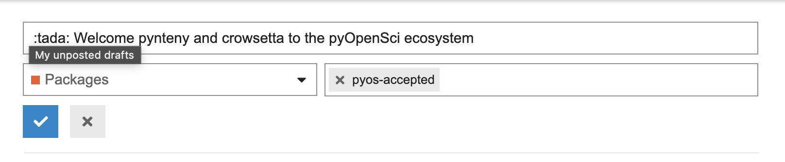
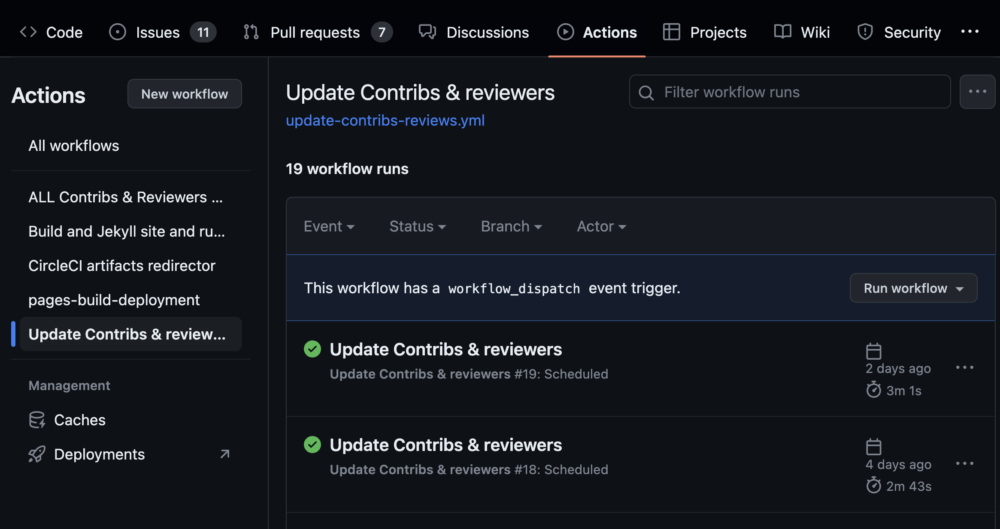
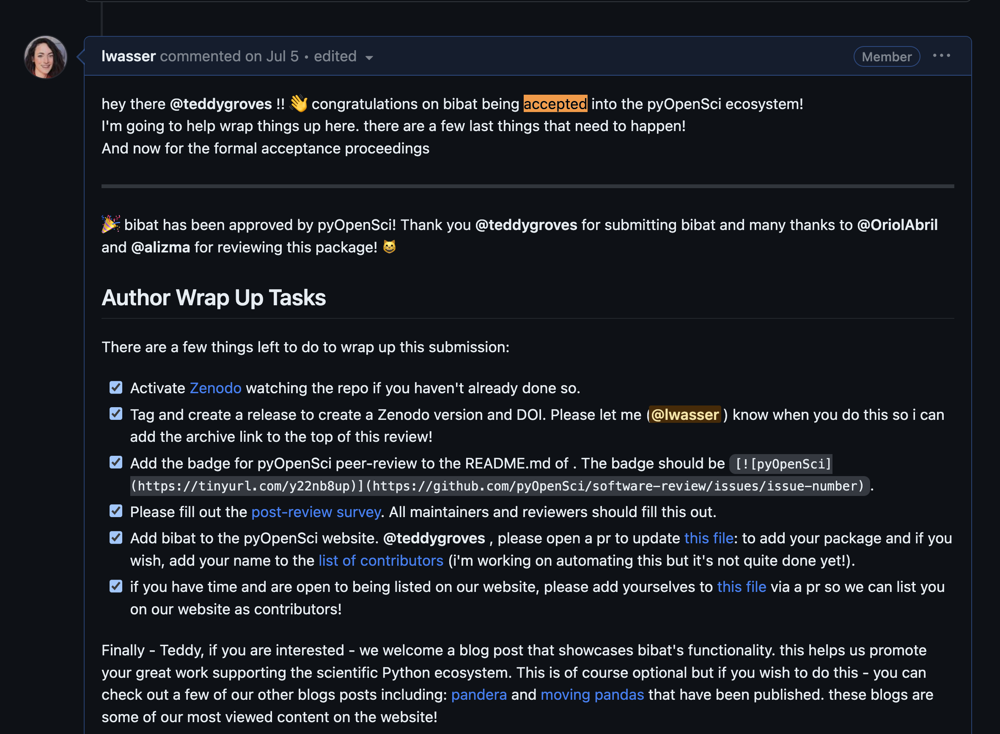
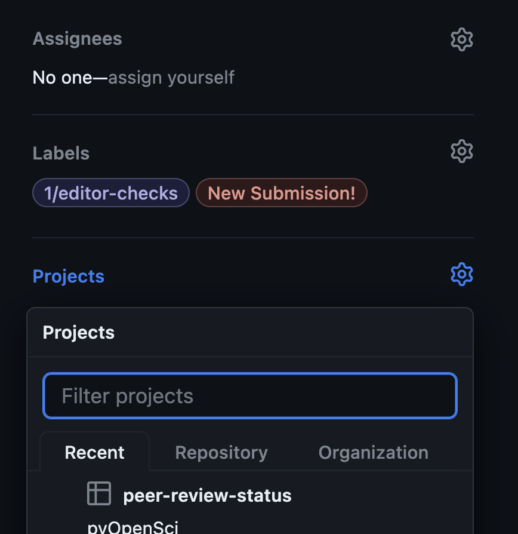
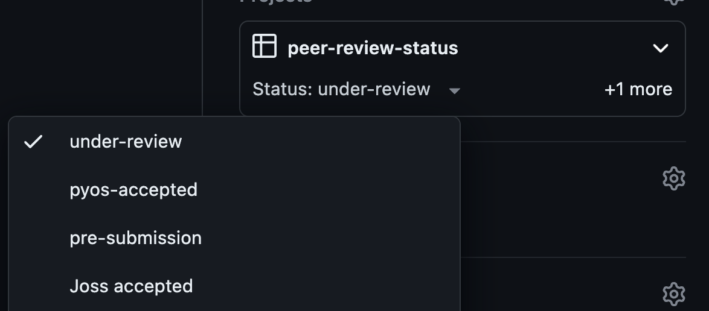

# Editorial Review Triage Team

The editorial board triage team focuses on ensuring review issues are complete with all metadata filled out in each GitHub review issue. Members of this team are considered a integral part of the [pyOpenSci editorial board](https://www.pyopensci.org/about-peer-review/index.html#our-editorial-board).

## Estimated time allocation for this team

It is estimated that the time associated with this role will be a few hours a month given we normally accept 1-2 packages each month.

```{note}
There may be (rare) periods where additional time is needed. These include
1) when we need to update old, dated reviews and
2) if many submissions are accepted in a particular  month.

In the case that a time-intensive update process is required such as a large
update to the review metadata structure, we can instill the help of others on
the editorial board to get caught up.

This role should never be a burdensome role on any individual community
volunteer.
```

## Why this team is needed

All pyOpenSci reviews happen on GitHub in the [software-submission repository](https://github.com/pyOpenSci/software-submission). The metadata associated with each review is what is used to populate the [packaging listing on our website](https://www.pyopensci.org/python-packages.html).

This team is important because:

1. Often when reviews wrap up, editors and maintainers are excited about the acceptance and forget to update the final metadata information.
2. Sometimes, we recognize the need for new metadata. And as such, we need to update older issues. This is rare but happens occasionally. See notes below on this type of effort as it may require help from the entire editorial team (or we can consider how to automate it).

The metadata for each review looks something like the example below. However, because pyOpenSci has been operating peer review since 2019, some of the older issues may be missing some critical metadata.

## About the metadata

The core metadata that should be available in every review includes:

- Submitting Author
- All current maintainers
- Package Name
- One-Line Description of Package
- Repository Link
- Version submitted
- Editor
- Reviewer 1
- Reviewer 2
- Reviewer 3
  - Sometimes there may be a third reviewer particularly in a mentorship situation or when specific domain expertise is required. We can add that to issues where it's needed but do NOT need it in every review.
- Archive:
  - This is a link to either a github tag archive or a zenodo badge
- JOSS DOI
  - This should be the JOSS badge associated with the JOSS pub
- Version accepted
- Date accepted (month/day/year)

### Example metadata in a review

This is an example of a review submission. Notice that information that has not yet been filled out has a TBD next to it. Also notice that the author has added a few items that are not in our core template such as `Documentation`. Extra items are ok. We can ignore extra items.

```markdown
Submitting Author: Name (@AlexanderJuestel)
All current maintainers: (@AlexanderJuestel)
Package Name: GemGIS
One-Line Description of Package: Spatial Data Processing for Geomodeling
Repository Link: https://github.com/cgre-aachen/gemgis
Version submitted: 1.0.11 (soon 1.1 with bug fixes for some methods and the API Reference once it is working, no major functionality changes)
Documentation: https://gemgis.readthedocs.io/en/latest/
JOSS Publication: https://joss.theoj.org/papers/10.21105/joss.03709 # We want to add the JOSS publication as well - but let's figure out a standardized way to do it. I think the JOSS badge would be great to display on our website.
Editor: TBD
Reviewer 1: TBD
Reviewer 2: TBD # Sometimes there may be a third reviewer particularly in a mentorship situation or when specific domain expertise is required
Archive: TBD
Version accepted: TBD
Date accepted (month/day/year): TBD
```

At the end of a review, the completed metadata should look something like the example below with all metadata items containing text.

Notice in the example below this particular review is missing the archive information and instead has `TBD`. This item should contain either a zenodo link to a tagged release or a tagged release link on GitHub. It is also missing the version accepted. But this review was accepted, as such we will want to update the metadata in the issue.

```markdown
Submitting Author: Sam Pottinger (@sampottinger)
All current maintainers: @sampottinger, @gizarp
Package Name: afscgap
One-Line Description of Package: Community contributed Python-based tools for working with public bottom trawl surveys data from the NOAA Alaska Fisheries Science Center Groundfish Assessment Program ([NOAA AFSC GAP](https://www.fisheries.noaa.gov/contact/groundfish-assessment-program)).
Repository Link: https://github.com/SchmidtDSE/afscgap
Version submitted: 0.0.7
Editor: [Filipe Fernandes](https://github.com/ocefpaf)
Reviewer 1: [Tylar Murray](https://github.com/7yl4r)
Reviewer 2: [Ayush Anand](https://github.com/ayushanand18)
Archive: TBD # TODO: Please add a link to the archive
Version accepted: TBD # TODO: add the version that was accepted eg 1.4
Date accepted (month/day/year): TBD # TODO: add the date
```

The issue should also have at least 1 or 2 final labels:

- 6/pyOS-approved 🚀🚀🚀
- 9/joss-approved

If it is missing those labels please add them as it makes sense for the state of the review. If there are other, older labels you can remove those.

## Responsibilities of the triage team

The review issue triage team's role is to do the following:

- Ensure that after each review is closed, all metadata are filled out
- Ensure that labels are updated accordingly. These labels are what we use to parse reviews that end up posted on our website, if they aren't labeled correctly they will not get automagically added.
- Ensure that the [post-review survey filled out](https://docs.google.com/spreadsheets/d/1jEk-DDpkz14Z07OX_o1cN2vHzVbJO6mQ83ihGXsWkLc/edit#gid=0) (for issues opened after March 2023)
- Help the software review lead update older issues when metadata items is missing.
- Update review status on project board
- Post on the [pyOpenSci Discourse packages channel](https://pyopensci.discourse.group/c/packages/8) announcing & celebrating that a successful review has been completed!
- Make sure JOSS tracking is happening as expected

The team might also do the following in some cases:

- Close issue if it is open but complete

## Celebrating accepted packages

We like to celebrate when a package is

1. accepted by pyOpenSci and
2. accepted by JOSS

As such the editorial triage team will post on the [pyOpenSci discourse site](https://pyopensci.discourse.group/c/packages/8) when we have a new accepted package.

To post on Discourse do the following:

1. head to Discourse and create a new post in the packages channel
2. tag the post with `pyos-acccepted`

:::{figure-md} fig-target



Image showing the discourse interface when you add a new post. The pyos-accepted tag is found under the the text box where you add the post title.
:::

Once you create the post, it will be cross-posted into the pyopensci-slack in the `software-review` channel via an automated slack-discourse bridge.

## Updating reviews & contributors using GitHub actions

The issue review team can also, as they wish update packages and reviewers on the website by enabling the update_reviews and update_contributors workflow. Or by simply merging an open PR as the action will run every few days submitting a new pull request.

To do this:

1. [Head to the pyOpenSci website repo](https://github.com/pyOpenSci/pyopensci.github.io/actions/workflows/update-contribs-reviews.yml).
2. Click the run workflow button to trigger a build that will update reviews and also editors, reviewers and associated contributions!

:::{figure-md} fig-target



When you go to the actions tab in github, you will see the Update Contribs and reviewers action. You can run that using the "run workflow" button. Once the workflow is run, a pr will be submitted with both an updated contributor list and an updated review list (if there have been new packages accepted and new contributors).
:::

Once you trigger this, the action will run and submit a pull request.

:::{figure-md} fig-target


This shows what a pr by the github actions bot looks like after the update contributor and review action has been run.
:::

You may notice that the pull request has a pre-commit failure. You can fix that by adding a comment to the bottom of the issue that says:

`pre-commit.ci autofix`

:::{figure-md} fig-target


When you have a failed pr run you can just add a comment with the text pre-commit.ci autofix and the bot will lint and fix the pr.
:::

Once checks have passed, you can merge this pr into the website repo to update reviews and contributions!

Finally, delete the branch associated with the PR.

## How to know when the package was accepted

In our peer review guide, we have a [template that editors should use](https://www.pyopensci.org/software-peer-review/how-to/editors-guide.html) to accept a package in to our ecosystem. In an issue you can look for this comment and use the date that the comment was posted as the date the package was accepted.

There are cases when editors forget to use this template. But ideally you can figure this out by searching for "accepted" in the review. OR you can simply just ask the editor in the `private-editorial` channel on our Slack.

:::{figure-md} fig-target



Image showing the generic template text used for accepting a package into the pyOpenSci ecosystem.
:::

```markdown
🎉 bibat has been approved by pyOpenSci! Thank you @teddygroves for submitting bibat and many thanks to @OriolAbril
and @alizma for reviewing this package! 😸
```

## How to confirm that the post-survey was filled out

At the end of each review we ask reviewers and the maintainers to fill out the post survey. You can check whether this has been completed by [looking at this document](https://docs.google.com/spreadsheets/d/1jEk-DDpkz14Z07OX_o1cN2vHzVbJO6mQ83ihGXsWkLc/edit?usp=sharing). NOTE: only editors have access to view this document. It simply contains a list of GitHub usernames that have completed the survey and the associated date. It will allow you to confirm that step was completed!

## Adjusting labels & the project board on an issue

Every issue has a label associated with it that tells us what
part of the process the review is in. Our automated workflow,
finds packages that were accepted using the `6/pyOS-approved`
tag (see below).

:::{figure-md} fig-target


If a package has been accepted it should have at least the pyos-approved label. If the package moves on to joss and is accepted it should have the joss label as well. If the package is actively in joss review it should have the under-joss review. Otherwise if it has been accepted it should have the 9/joss-accepted label.
:::

Often times it's easy for an editor to celebrate a review ending and forget to add that final tag. Or sometimes they might forget that they need to follow the package as it goes through the JOSS process (if it goes on to that process).

The triage team should ensure that all accepted packages have the `6/pyOS-approved` label associated with them. You can remove any other labels on the issue once a package is approved. We can assume it's gone through all of the appropriate checks!

In the case of a JOSS submission after our review, you can make sure that the editor is updating the label on the issue associated with JOSS. the final label once the package is JOSS accepted is
9/JOSS-approved

:::{figure-md} fig-target


The joss labels indicate the state that a package is in.
Once JOSS has accepted the package, you should ensure that 9/joss-approved if the final label. At this point the package review issue can be closed if all lose ends are complete!
:::

### Updating the software-review project board

We keep track of our reviews using the peer-review-status project board.

:::{figure-md} fig-target



When a review is just starting, the assignee should be the editor leading the review. The labels will begin with editor-checks. You can also set the peer-review state on the project board.
:::

When a package is accepted you can also update the project board to the "pyos-accepted" (or JOSS accepted) status. Given the nature of our partnership with JOSS, we can always assume that if a package got to the JOSS stage it was already accepted by pyOpenSci.

:::{figure-md} fig-target



We use the project board to track the status of reviews.
:::

## Organization permissions needed for the editorial triage team

The triage team will need the following permissions within the [pyOpenSci
GitHub organization](https://github.com/pyOpenSci) to complete their responsibilities.

Team members will need:

- to be a part of the pyOpenSci GitHub organization
- merge permissions on [pyopensci.github.io repository.](https://github.com/pyOpenSci/pyopensci.github.io)
- edit permissions for reviews in the software-submission repository
- access to post in the slack pyos-updates channel
- an account in the [pyOpenSci discourse](https://pyopensci.discourse.group/c/pyopensci-updates/13) to post updates there.
