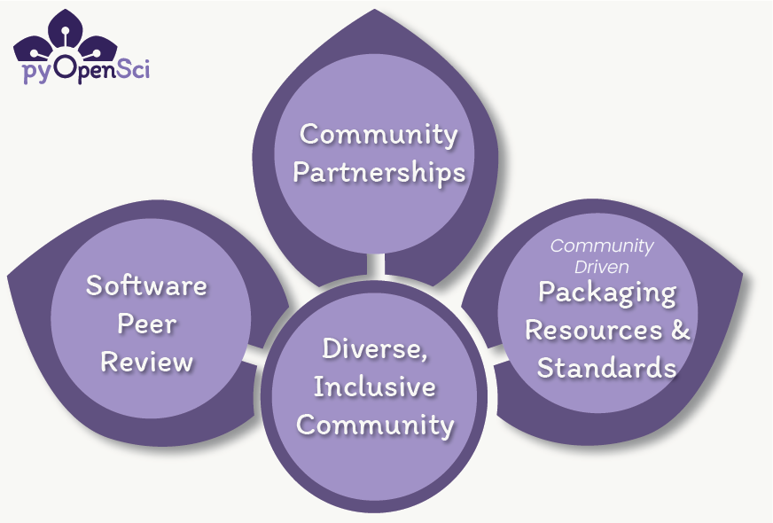
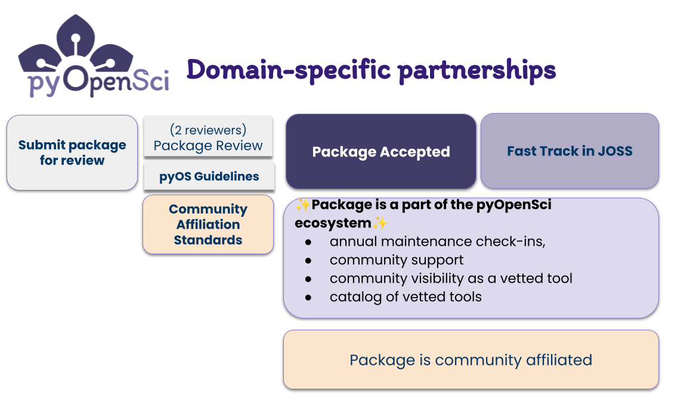

# Partnerships with scientific Python Communities

:::{toctree}
:hidden:
:caption: Our Partners

About Our Partnerships <self>
JOSS <joss>
Astropy <astropy>
Pangeo <pangeo>
:::

:::{figure-md} pyopensci-3-pillars

pyOpenSci has three core programs. 1. Our community partnerships program allows domain specific scientific Python communities to leverage our peer review process rather than creating their own process. Through this partnership maintainers can become affiliated with both a domain specific community, published in the Journal of Open Source Software and also become a part if the pyOpenSci community. 2. The community partnerships program leverages our software peer review program. 3. We create packaging and open science related tutorials and guidance. All of these programs are supported and driven by a diverse, inclusive community.
:::

Numerous science domain-specific scientific Python communities are developing and maintaining their own peer review
processes to track and recommend packages that relevant to their science domain.
However, running a high quality peer review process takes time and resources.

pyOpenSci offers a program where communities can partner with us, and leverage our peer review process, which is
built on community-driven packaging guidelines and standards. Through this partnership, we enhance our standard review process with a community-specific
step that adds your specific requirements for package affiliation.

:::{figure-md} pyopensci-partners

Through this partnership we add an additional layer of checks to our peer review process that align with a domain specific communities needs. Often these checks are around packages using existing core functionality of community tools, and adhering to community specific data structure formats.
:::

:::{figure-md} pyopensci-joss-community

Through this single end-to-end review process, a package can become vetted and affiliated with a domain-specific community, part of the pyOpenSci ecosystem and also published in JOSS.
:::

## What do we get when we become a pyOpenSci partner?

In addition to [the core benefits that pyOpenSci peer review provides](/about/benefits),
we will provide you with the following:

### Visibility for your community and associated Python packages

1. We will create a community page in this peer review guide where you can define your guidelines for a package to become affiliated with your community. Check out the
   [pangeo example](pangeo) as an example of what this looks like.
2. A dedicated community page on the pyOpenSci website. Here, we will
   list your community along with all affiliated packages that have
   successfully undergone our review process. You can add descriptive text and graphics and branding to the page as you wish.

### Packaging Support

Our vibrant community is filled with experts in the Python packaging space. A
partnership with us means that you will always have support from our diverse community of Pythonistas if you run into
Python packaging and software maintenance challenges.

:::{admonition} What's in the works
:class: note

pyOpenSci is enhancing our peer review process and working on:

- Adding an editorial bot to our peer review infrastructure to streamline our review processes.
- Collecting package metrics to track health and also understand maintenance status.

:::

## Partnership benefits to the broader scientific community

The benefits for the broader scientific Python community include:

- We have broad reach across the entire scientific Python ecosystem which allows us to promote your community and associated packages.
- We have a broad view across all domains within the scientific Python ecosystem which will help us to identify overlap of package functionality across domains and potentially aggregate efforts in the future as it makes sense (i.e., if a maintainer needs to step down).
- We offer an established peer review process will help enforce standardization of scientific Python packaging and best practices across the ecosystem. Our volunteer-lead peer review process has been operating since 2019.

## How peer review works for partners

The pyOpenSci peer review process can be broken down into 5 steps when a package is submitted for review:

1. To kick things off, an Editor-in-Chief checks that the package passes our [bare-minimum checks](https://www.pyopensci.org/software-peer-review/how-to/editor-in-chief-guide.html#editor-checklist-template).
2. Once Editor-in-Chief checks are passed, they assign a domain-expert editor to the review.

Through our partnership, we have two options when selecting an editor.

- If the editor is someone from your partner community who has authority, they can determine whether the package meets the decided-upon criteria to become affiliated with your community.

- If we have a domain specific editor who is not authorized by your community to make this decision, we can ask someone from your community to make the decision around affiliated status. Once the decision is made, the review can proceed as normal.

3. Once affiliated status has been determined, the editor finds 2 reviewers to begin the review.
4. The review begins and is a conversation between the package maintainer and the reviewer with the goal of improving the package usability and quality.
5. Once the package is accepted by pyOpenSci, authors can opt to be published in the Journal of Open Source Software (JOSS) if their package is in scope for JOSS. JOSS will accept the pyOpenSci review and will only review the JOSS paper. If the package is within JOSS's scope, the JOSS fast-track process is normally a quick final step.

Through the above steps, an accepted package can become pyOpenSci accepted, JOSS
published and an official affiliated package with your community.

## How we find editors and reviewers

One of the most common concerns that communities have is finding editors and
reviewers. While finding volunteer editor and reviewers takes time, we are
confident that we can figure this out together.

For every review we like to have an editor and at least 1 reviewer with some
scientific domain expertise associated with the submitted package (and your
community). Where possible we will make calls within your community to find
editors and reviewers who understand your domain. However, we also have a broad
pool of editors and reviewers across scientific domains that will allow us to
fill gaps as needed. For instance, if your community is from the bio-medical
single-cell domain we may be able to find editors in the broader field
of genomics that could easily manage leading a review as an editor.

We have been running software peer review since 2019 and have never not been able to
review a package because of editor / reviewer availability. However, sometimes
it might take a bit longer to find the right people to begin the review.

### How can people sign up to review?

pyOpenSci maintains a reviewer database with individuals who have signed
up using our [reviewer sign-up form](https://forms.gle/GHfxvmS47nQFDcBM6).
Our goal is to assign two reviewers for each package. Typically, one
reviewer possesses domain-specific expertise while the second may
focus on usability, installation, documentation, or packaging
infrastructure, without necessarily needing domain expertise.

We prioritize diversity among contributors in every review, ensuring
inclusion of individuals with different gender, cultural backgrounds,
and identities.

## Frequently asked questions

Below is a list of questions that we get asked about our community partnerships.
If you have a question that is now answered here, feel free to ask it on the
[pyOpenSci discourse forum](https://pyopensci.discourse.group/).

### General peer review questions

:::{dropdown} How do I get my community involved?
:animate: fade-in-slide-down

We are always open to new partners. Please feel free to ask questions or to
leave a post on [our discourse forum](https://pyopensci.discourse.group/). We
can connect with you from there. You can also email us directly at
admin at pyopensci.org.
:::

:::{dropdown} What if there is a conflict of interest
:animate: fade-in-slide-down

pyOpenSci's [conflict of interest policy can be found here](https://www.pyopensci.org/software-peer-review/our-process/policies.html#conflict-of-interest-for-reviews-and-editors).
:::

:::{dropdown} How do I know that a review is community-affiliated?
:animate: fade-in-slide-down

We will add your community name as a label to our review repository here. This will allow anyone to filter for reviews specific to your community. Here is an example of the [community tag for Pangeo](https://github.com/pyOpenSci/software-submission/issues?q=is%3Aissue+label%3Apangeo+).
:::

### Affiliated review / pyOpenSci integration questions

:::{dropdown} Where do affiliated guidelines get published?
:animate: fade-in-slide-down

The criteria for a package becoming affiliated with a community needs to be clearly communicated on the partner landing page in our peer review guide. These are the criteria that will be evaluated during our review process to determine whether a package should gain affiliated status with your community.
:::

:::{dropdown} Can a package be accepted by pyOpenSci but not affiliated?
:animate: fade-in-slide-down

Sometimes, a package may be accepted by pyOpenSci but not meet community
affiliation criteria. In such cases, the package will still be listed as an accepted pyOpenSci package. However, it will not receive community affiliation status.

While rare, if a package is rejected by pyOpenSci but the community
editor believes it should be affiliated, they can make that call.

In such cases, pyOpenSci won't list the package on its website, but the
community can list it on their page.

:::

:::{dropdown} When does the package get evaluated for affiliation in your peer review process?
:animate: fade-in-slide-down

We request that your community appoint a minimum of two individuals to
serve on our editorial board. During the initial Editor-in-Chief phase
of our peer review process, we assess whether a package aligns with the
scope of pyOpenSci. For potential community-affiliated packages, the
editor, who is a member of your community, will evaluate the package at the beginning of the review process. We can also perform a second review at the end of the process if requests were made for changes to the package that would allow it to become affiliated with your community.

:::

:::{dropdown} How do we list pyOpenSci-accepted packages on our website post-review?
:animate: fade-in-slide-down

You can also access are most recent list of accepted packages using this [.yml file which drives
our website here](https://github.com/pyOpenSci/pyopensci.github.io/blob/main/_data/packages.yml).
This file is updated using a cron job several times a month and can be filtered by your specific community to support your website development workflow. [The full listing of packages can be found here.](https://www.pyopensci.org/python-packages.html)
:::

### Package maintenance

::::{dropdown} "Rereview" of packages & package maintenance
:animate: fade-in-slide-down

A core goal of pyOpenSci is to support long-term maintenance of scientific Python
packages. To achieve this, we monitor repository activity for all
our packages to detect any signs of becoming unmaintained.

However, pyOpenSci does not conduct full re-reviews, involving the Editor-in-
Chief, Editor, and two reviewers, for packages that have already been
accepted.

:::{note}

We intend to establish automated checks to monitor the "health" and
maintenance status of packages over time. These checks aim to identify
unmaintained packages. [View our process for this here](https://www.pyopensci.org/software-peer-review/our-process/policies.html#maintainer-responsiveness).

Once we identify a tool requiring additional maintenance, we will flag it
for our user community.

:::

In the event that a package becomes unmaintained, we will adhere to
the [current pyOpenSci policies regarding package maintenance post-review](https://www.pyopensci.org/software-peer-review/our-process/policies.html#after-acceptance-package-ownership-and-maintenance).

If it's a widely-used package and the maintainer wishes to see it
continue, we will make efforts to assist the maintainer in finding a
new team of maintainers.

Otherwise, we will gracefully sunset it, removing it from our list
of actively maintained and accepted packages.
::::

:::{dropdown} How will you track package maintenance?
:animate: fade-in-slide-down

We will track package maintenance by collecting metrics such as the commit frequency,
releases, and passing tests. Some, if not most, of this
data collection will be automated using the GitHub API and other community tools.
:::

### Packaging guidelines

:::{dropdown} How do you develop your packaging guidelines?
:animate: fade-in-slide-down

## Packaging Guidelines

pyOpenSci is developing a [community-driven packaging guide](https://www.pyopensci.org/python-package-guide/)
that encompasses modern best practices and recommendations for scientific
Python packaging. This guide undergoes a stringent community review process
involving reviewers from various groups, including members of PyPA, the core
Python team, Anaconda, conda/conda-forge maintainers, and maintainers of
core packages and front-end/back-end tools (e.g., flit, PDM, hatch/hatchling,
etc.). Additionally, it is actively maintained by members of both the scientific
Python community and maintainers.

:::

:::{dropdown} What if we already have community packaging guidelines?
:animate: fade-in-slide-down

While it's perfectly fine if your community has its own packaging guidelines,
we encourage the broader scientific community to adopt similar packaging best
practices. Doing so will enhance the experience for new contributors across
different domains. If you have the bandwidth and are interested in
collaboration, we welcome contributions to our community-driven pyOpenSci
packaging guide.
:::

## For communities with existing peer review processes

For communities with existing peer review processes and accepted packages,
we recommend the following steps:

1. If you're in the process of transitioning your review process, start by
   looking for packages that have recently entered the review phase.
   Reach out to the maintainers of these packages and see if they'd be
   interested in shifting their review to pyOpenSci. If you already have
   an editor leading the review, they can become a guest editor on our
   board and continue the review using our process. We're also available
   to mentor any new editors through our review process.

2. For packages that have already undergone review, consider prioritizing
   the older ones. Older packages are more likely to become unmaintained
   over time. This presents an excellent opportunity to re-evaluate
   packages that were accepted in previous years by taking them through
   our pyOpenSci peer review process.

### Review is scary. How do we convince our package maintainers to do more work?

We recognize that peer review can feel daunting, especially for those
from academic backgrounds. Our review process diverges from conventional
methods. We see review as a constructive dialogue involving the maintainer
team, reviewers, and an editor, all collaborating to enhance the package's
quality and user-friendliness. Occasionally, our editors and reviewers even
create issues and pull requests. Our community is readily available to
address technical inquiries.

Although participating in a review demands extra time and effort, the
benefits are substantial. Improving packaging infrastructure, documentation,
and code makes your package more accessible and welcoming to contributors.
Over time, this investment will yield significant rewards.

All our reviews are open on GitHub, ensuring transparency. Everyone
participating in the peer review process is also expected to adhere to [our
code of conduct.](https://www.pyopensci.org/handbook/CODE_OF_CONDUCT.html)
